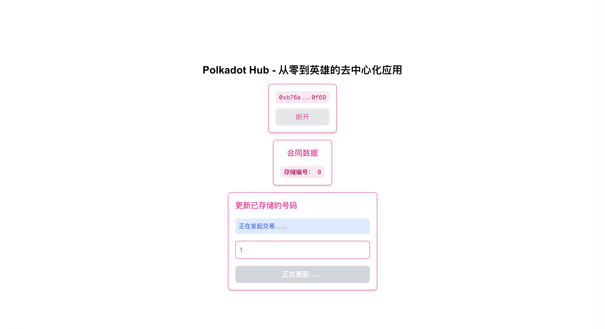

# Polkadot Dapp

使用 viem 和 Next.js 构建了一个功能齐全的 dApp，该 dApp 可与 Polkadot Hub 上的智能合约进行交互。

Project Milestones
## Smart Contract Development & Deployment

Create a smart contract using Hardhat and deploy it to the Polkadot Hub Testnet.

## Wallet Integration & Network Management

Connect to the user's wallet and handle automatic network switching.

## Real-time Data Fetching

Read data from the smart contract and ensure the UI stays synchronized/updated.

## On-chain Transactions

Write data to the blockchain via on-chain transactions.

## State Updates

Update and store a new number on the blockchain.

##
